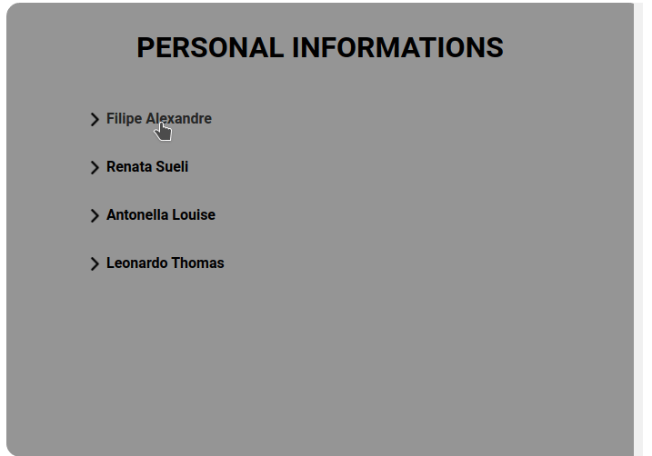

<h1 align="center"> Cause Effect App 🖱️ </h1>

  <a href="#-projeto">Projeto</a>&nbsp;&nbsp;&nbsp;|&nbsp;&nbsp;&nbsp;
  <a href="#%EF%B8%8F-tecnologias">Tecnologias</a>&nbsp;&nbsp;&nbsp;|&nbsp;&nbsp;&nbsp;
  <a href="#--funcionalidades">Funcionalidades</a>&nbsp;&nbsp;&nbsp;|&nbsp;&nbsp;&nbsp;
  <a href="#%EF%B8%8F--autor">Autor</a>&nbsp;&nbsp;&nbsp;|&nbsp;&nbsp;&nbsp;
  <a href="#-licen%C3%A7a">Licença</a>

 

 
  

 

### 💡 Projeto

Uma lista de nomes de pessoas. Assim, ao clicar sobre os nomes é mostrado algumas informações pessoais.

### ⚙️ Tecnologias

- [Javascript](https://developer.mozilla.org/pt-BR/docs/Web/JavaScript)
- [CSS](https://developer.mozilla.org/pt-BR/docs/Web/CSS)
- [HTML](https://developer.mozilla.org/pt-BR/docs/Web/HTML)

### 🔨  Funcionalidades
 - [x] O usuário pode ver uma lista de nomes de pessoas organizados verticalmente em um painel de resumo na página.
 - [x] O usuário pode clicar em um nome na lista para atualizar um painel adjacente na página com o nome completo, endereço, número de telefone e aniversário desse indivíduo.
 - [x] O usuário pode clicar em outro nome na lista para atualizar o painel de detalhes com as informações desse indivíduo.

### ✒️  Autor

 👤 **Gabriel Henrique**

  - Github: [@Gabriek0](https://github.com/Gabriek0)
  - LinkedIn: [@gabriel-henrique-664bb219a](https://www.linkedin.com/in/gabriel-henrique-664bb219a/)

### 📜 Licença
- 
